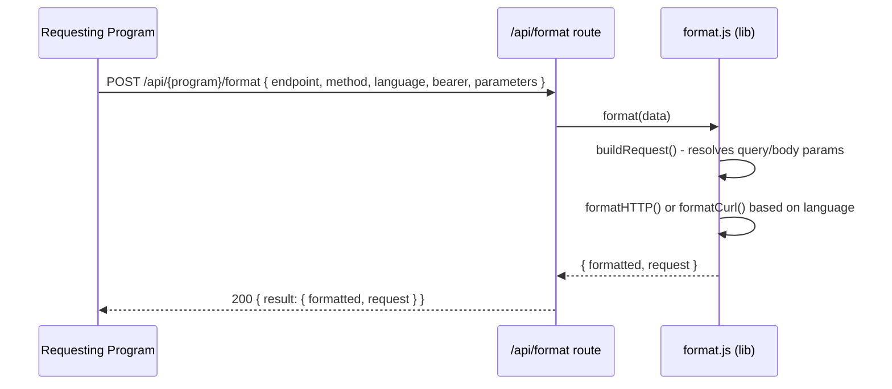

# API Request Formatter Microservice

Formats API requests sent to the microservice endpoint(s) into HTTP, cURL, etc. syntax given an endpoint, method, and parameters. 

---

## How to REQUEST data from the microservice

Send a `POST` request to `/api/{program}/format` with a JSON body containing the following fields:

| Field        | Type     | Required | Description                                      |
|--------------|----------|----------|--------------------------------------------------|
| `endpoint`   | string   | yes      | TMDB API endpoint path (e.g. `/movie/{movie_id}`)|
| `method`     | string   | yes      | HTTP method (`GET`, `POST`, etc.)                |
| `language`   | string   | yes      | Output format: `"http"`, `"curl"` , `"etc"`             |
| `bearer`   | string   | yes      | Output format: string for token   |
| `parameters` | array    | no       | List of parameter objects (see below)            |

Each object in `parameters` has:

| Field   | Type   | Description                                      |
|---------|--------|--------------------------------------------------|
| `key`   | string | Parameter name                                   |
| `value` | string | Parameter value                                  |
| `type`  | string | Either`"query"`, or `"body"`                     |

### Example request (JavaScript)

```js
const response = await fetch("/api/{program}/format", {
    method: "POST",
    headers: { "Content-Type": "application/json" },
    body: JSON.stringify({
        endpoint: "/movie/550",
        method: "GET",
        language: "curl",
        bearerToken: "test",
        parameters: [
            { key: "test key", testvalue: "test value", type: "body" }
        ]
    })
});

const data = await response.json();
console.log(data.result.formatted);
```

---

## How to RECEIVE data from the microservice

The microservice responds with a JSON object containing:

| Field            | Type   | Description                                      |
|------------------|--------|--------------------------------------------------|
| `result.formatted` | string | The formatted HTTP or cURL request string      |
| `result.request`   | object | The parsed request object (method, endpoint, body, baseURL) |

### Example response

```json
{
  {
  "result": {
    "formatted": "GET https://api.themoviedb.org/3/movie HTTP/1.1\nAuthorization: Bearer test\nAccept: application/json\n\n{\n  \"test key\": \"test value\"\n}",
    "request": {
      "method": "GET",
      "endpoint": "/movie",
      "body": {
        "test key": "test value"
      },
      "baseURL": "https://api.themoviedb.org/3",
      "bearerToken": "test"
    }
  }
}
}
```

### Error response

If the request fails, the microservice returns:

```json
{
  "error": "Failed to format request",
  "message": "<error details>"
}
```

---

## UML Sequence Diagram
(Used mermaid to generate the diagram as an FYI)


